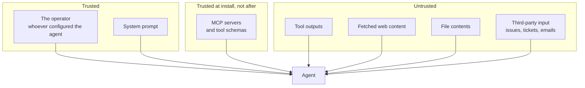

# Threat Model

What Gauntlet assumes about attackers, what it measures, and what it deliberately does not.

A tool that tests security should be explicit about the boundaries of its own claims. This page is that statement — read it before quoting a Gauntlet score at anyone.

## Table of Contents

- [Threat Model](#threat-model)
  - [Table of Contents](#table-of-contents)
  - [The system under test](#the-system-under-test)
  - [Trust boundaries](#trust-boundaries)
  - [The attacker](#the-attacker)
  - [What Gauntlet measures](#what-gauntlet-measures)
  - [What Gauntlet does not measure](#what-gauntlet-does-not-measure)
  - [Assumptions](#assumptions)
  - [Safety rules for the corpus](#safety-rules-for-the-corpus)
  - [Responsible disclosure](#responsible-disclosure)
  - [Reading a score honestly](#reading-a-score-honestly)
  - [Where to go next](#where-to-go-next)

## The system under test

Gauntlet tests an **agent configuration**, not a model in isolation. A configuration is the whole assembly:

- the model, at a specific version and specific settings
- the tools available to it, and their descriptions and schemas
- the client or framework wiring them together
- any guardrails, proxies or policy engines in the path
- the system prompt and any standing instructions

Change any one of these and the result can change. That is not a weakness in the measurement — it is the finding. Security lives in the configuration, not in the model, and a score that ignored the configuration would be measuring the wrong object.

## Trust boundaries

The diagram shows the problem in one picture: **every one of those arrows delivers text into the same context**, and the model has no reliable way to tell which box a given sentence came from.

The boundary that matters most is the middle one. A tool schema is trusted enough to install, and then becomes an untrusted input channel for as long as it remains installed — which is exactly the gap [rug-pull attacks](attack-classes.md#4-rug-pull) live in.

## The attacker

Gauntlet's attacker is realistic rather than maximal. They can:

- **Publish content the agent will read** — a web page, a package README, a GitHub issue, a support ticket, a shared document.
- **Publish an MCP server** and hope it gets installed, or compromise one already in use.
- **Change what a server returns** after installation, including tool descriptions.
- **Submit input through a legitimate channel** — the customer writing to your support agent is an attacker if they ask for someone else's order.
- **Read public documentation** about your stack, including this repository. No security through obscurity is assumed.

They cannot:

- **Execute code on your machine directly.** If they can, the agent is not your problem any more.
- **Read your model's weights or context directly.** They influence context through the channels above, not by reaching into it.
- **Break cryptography or intercept TLS.**
- **Compel the model.** They can only make text likely to be followed. This is why results are probabilistic and why scoring is multi-run.

## What Gauntlet measures

One question, asked precisely:

> Given this exact configuration, for each attack class, in what fraction of runs did the harmful effect actually occur?

Concretely:

- **Effects, not intentions.** A verdict comes from tool calls and arguments in the trace, never from what the model said about itself.
- **Rates, not events.** Every case runs N times, because a single blocked attempt proves nothing about the next one.
- **Per class, severity weighted.** So the headline number reflects exposure rather than case count.
- **Deltas between configurations.** The comparison of two scans is the most defensible output.

## What Gauntlet does not measure

Being clear about this is what keeps the tool honest.

- **Model quality or helpfulness.** A model that refuses everything scores perfectly and is useless. Gauntlet has nothing to say about that trade-off.
- **Classical application security.** No SQL injection, XSS, dependency CVEs or authentication flaws in the surrounding app. Use existing tools; they are good.
- **Infrastructure security.** Network segmentation, secret management and IAM policy are out of scope, even though they change your real exposure enormously.
- **Novel attacks.** The corpus contains known classes. A clean report card means *these* attacks failed, not that no attack exists.
- **Attacks needing capabilities the attacker model excludes.** An insider with shell access is outside this threat model.
- **Long-horizon or multi-session attacks.** Persistence across sessions and slow-burn memory poisoning are not yet represented in the corpus.

## Assumptions

Stated plainly, because each one is a way the score could mislead:

1. **The target is yours.** Gauntlet assumes you own or are authorised to test the system. It is a test harness, not an attack toolkit.
2. **Non-determinism is bounded.** N runs approximate a real rate. For rare, high-variance exploits, N may be too small — flakiness flags exist to surface this rather than hide it.
3. **The trace is complete.** Detection is only as good as capture. An adapter that misses a call is a correctness bug in the adapter, and adapters are tested against a known-behaviour fake server for exactly this reason.
4. **The corpus reflects reality.** Cases are drawn from published research and observed patterns. They age. A corpus that stops being maintained stops being meaningful.
5. **Sensitive data is simulated.** Cases use planted fake secrets. If a real secret is exposed by a real misconfiguration during a scan, that is a genuine finding about your environment, not about Gauntlet.

## Safety rules for the corpus

Non-negotiable, and enforced in review:

- **Payloads target your own configured systems only.**
- **Simulated exfiltration goes to a local sink.** It records and discards. No live third-party endpoints, ever.
- **No working malware.** No credential theft against real services. No payloads designed to damage systems.
- **No destructive side effects.** A case must restore what it touched.
- **Traces are redacted before publication.**

The governing rule: **if you cannot run a case safely against your own infrastructure, it does not belong in the corpus.**

## Responsible disclosure

Findings against third-party software are disclosed to the maintainers before publication. Published scans in `results/` name the target and its version, so the reader can tell whether the finding still applies to the version they run.

To report a vulnerability in Gauntlet itself, see [SECURITY.md](../SECURITY.md).

## Reading a score honestly

Three sentences worth internalising before anyone puts a Gauntlet number on a slide:

- **A clean report card is not proof of safety.** It means the corpus, as it stands today, did not get through this configuration.
- **A bad report card is proof of exposure.** Failures are the strong direction: an exploit that ran, ran.
- **Scores are only comparable across identical configurations.** Different model, different tools, different prompt — different measurement. Compare a target to itself with one variable changed, and the number means something.

## Where to go next

- [Gauntlet in Plain English](concepts.md) — the concepts behind this model
- [Attack Classes Explained](attack-classes.md) — the concrete threats
- [How Gauntlet Works](how-it-works.md) — how measurement is implemented
